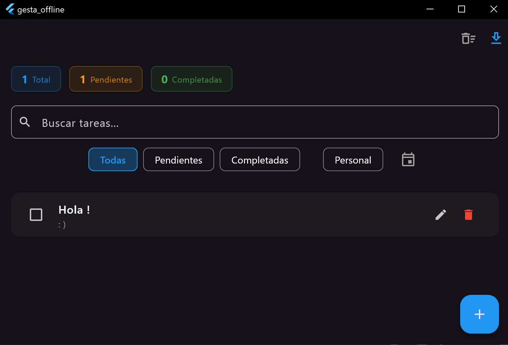

# GesTa - Gestor de Tareas

Aplicación para gestionar tareas personales con dos versiones en dos plataformas (Windows/Android):

- **Online**: Con conexión a Firebase (autenticación y sincronización en la nube) para conectar ambas aplicaciones
- **Offline**: Sin conexión, datos guardados localmente en JSON
  
*Proyecto desarrollado para uso personal y como proyecto de estudiante de DAM. El código fuente no está disponible en este repositorio, la versión de 
Windows hecha con manuales y ayuda puntual de IA, la versión Android un fork vibecodeado.*

---

## 📥 Descargas

| Plataforma | Online | Offline |
|------------|--------|---------|
| **Windows** | [Descargar](https://drive.google.com/file/d/1AXQ9J5f2bAbuzKueRnnpmJsV5e1f5vPb/view?usp=drive_link) | [Descargar](https://drive.google.com/file/d/1BNFKXZr7JW6OU94szEmjqVDMhBwjDhEr/view?usp=drive_link) |
| **Android** | [Descargar](https://drive.google.com/file/d/15Gw0QKx_HJmjN39Atr6sFPqd6v1AtbSy/view?usp=drive_link) | [Descargar](https://drive.google.com/file/d/1kUG58N-Zi8lgRA3cT6PwqcyIJcTlXodm/view?usp=drive_link) |

---

## 📱 Instalación

| Plataforma | Pasos |
|------------|-------|
| **Windows** | Descargar ZIP → Descomprimir → Ejecutar `.exe` |
| **Android** | Descargar ZIP → Descomprimir → Instalar `.apk` |

---

## 📌 Funcionalidades

- ✅ Crear, editar y eliminar tareas
- ✅ Marcar tareas como completadas
- ✅ Categorías y filtros
- ✅ Búsqueda por texto
- ✅ Fecha límite con hora
- ✅ Exportar a CSV, PDF y JSON 
- ✅ Importar desde JSON 
- ✅ Sincronización en tiempo real (Online)
- ✅ Notificaciones locales (Android)

---

## 🛠️ Tecnologías

- Flutter 3.x
- Firebase (Online)
- Provider
- Hive / JSON (Offline)

---

